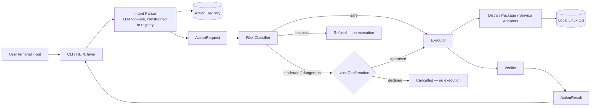
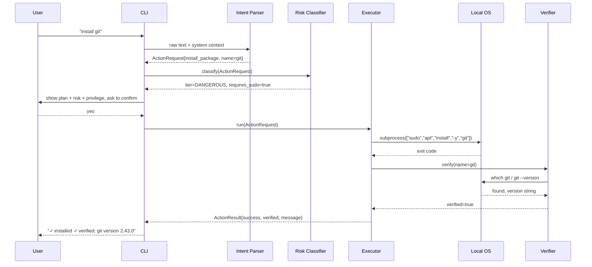
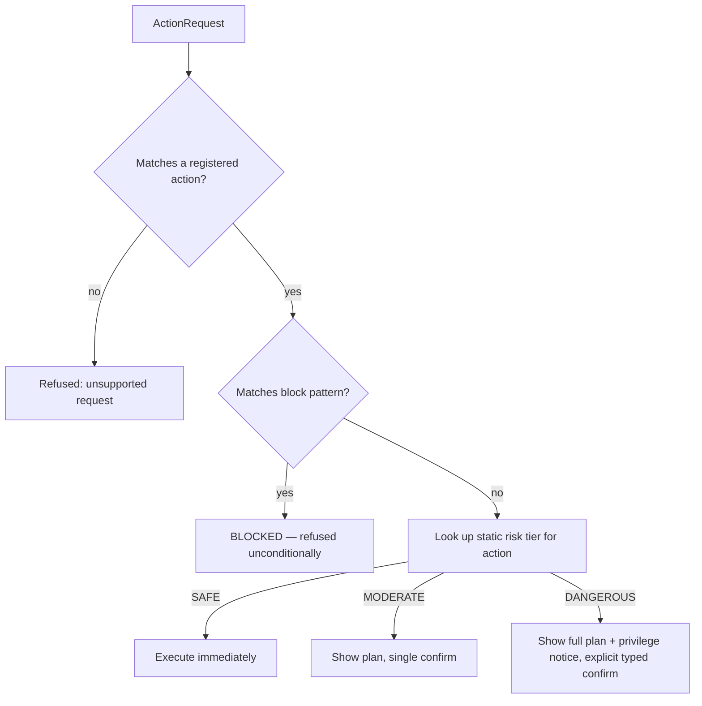
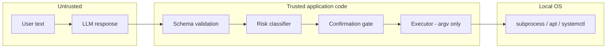

# Architecture.md — LinuXpert System Architecture

**Status:** MVP planning — pre-implementation
**Companion documents:** [PRD.md](./PRD.md), [Rules.md](./Rules.md), [Phases.md](./Phases.md), [Design.md](./Design.md)

---

## 1. Guiding Principle

The LLM's job ends at producing a **structured, schema-valid action call**. Everything that follows — risk classification, confirmation, execution, verification — is deterministic Python code with no model in the loop. This is not a layer that can be "tightened later"; it is the architecture, and it must exist before the action list grows past the first two or three actions (see [Phases.md](./Phases.md)).

A second principle, specific to the 6-day timeline: **favor a closed system over an extensible one.** No plugin loader, no dynamic action discovery, no config-driven registry loaded from an untrusted source. The action registry is a small, fixed set of Python objects defined in code and reviewed like any other code.

---

## 2. High-Level Architecture



Everything left of the Risk Classifier only ever produces data (an `ActionRequest`); nothing left of the Risk Classifier is allowed to touch the operating system. That boundary is enforced by module structure (see §12) as well as by convention: the intent-parsing module has no import of, or access to, `subprocess`.

---

## 3. Component Architecture

| Component | Responsibility | Does **not** do |
|---|---|---|
| **CLI / REPL** | Read user input, render output (plans, confirmations, results) per [Design.md](./Design.md), drive the request loop | Interpret intent, decide risk, execute commands |
| **Intent Parser (NLU)** | Send user text + relevant system context to the LLM via tool-use; receive exactly one structured action call; validate it is a known action | Execute anything; decide risk tier; invent actions outside the registry |
| **Action Registry** | Canonical, code-defined list of supported actions, each with a name, parameter schema, risk tier, privilege flag, `plan()`, `run()`, `verify()` | Accept new actions at runtime; trust unvalidated input |
| **Risk Classifier** | Look up the static risk tier for a resolved action (and, where relevant, its parameters); run the block-pattern check | Ask the LLM's opinion; execute anything |
| **Confirmation Layer** | Render the plan preview; collect explicit user approval for moderate/dangerous actions | Auto-approve; weaken based on user impatience |
| **Executor** | Turn an approved `ActionRequest` into real subprocess calls via the distro/package/service adapters, using argument lists only | Build shell strings; run anything not already approved |
| **Distro Detector** | Read `/etc/os-release` once at startup; expose the detected family to adapters | Guess when detection is inconclusive — fail closed with a clear message |
| **Package Manager Adapter** | `apt`-specific install/verify calls behind a small interface | Support other package managers in MVP |
| **Service Manager Adapter** | `systemctl`-specific start/stop/restart/status calls behind a small interface | Manage non-systemd inits |
| **Verifier** | Re-check real system state after execution (binary on `PATH`, service active, file exists, etc.) | Trust exit code alone |
| **Result Reporter** | Turn an `ActionResult` into the plain-language message shown to the user | Hide partial failures |

---

## 4. Request Lifecycle



For a **blocked** request, the sequence terminates at the Risk Classifier — no subprocess is ever constructed, and the refusal message is generated directly from the block-pattern match.

---

## 5. Natural-Language Processing Flow

1. CLI collects the raw sentence plus lightweight system context (detected distro family, package manager, and — where cheap — whether the target already exists, e.g. `is_installed("git")`).
2. This is sent to the LLM with the action registry exposed as tool/function definitions (name, description, JSON parameter schema) — one tool per action.
3. The LLM is instructed (via system prompt) to select exactly one tool call, or to indicate "no matching action" if the request doesn't fit any registered action.
4. The response is parsed as a tool call; if it isn't a valid, schema-conforming call to a known tool, treat it as "no matching action" — never as free text to execute.
5. Parameters are then independently re-validated in code against the action's own schema (type, allowed characters, length) before any further processing. The LLM's output is a suggestion the code re-checks, not a trusted instruction.

No conversation memory or multi-turn planning is required for MVP — each request is handled independently.

---

## 6. Structured Action System

Every action implements the same small contract:

```python
@dataclass
class ActionRequest:
    action_name: str
    params: dict[str, Any]
    raw_text: str            # original user sentence, for logging/debugging

@dataclass
class ActionResult:
    success: bool
    verified: bool
    message: str              # plain-language, shown to user
    risk_tier: RiskTier
    commands_run: list[list[str]]  # argv lists actually executed

class Action(Protocol):
    name: str
    description: str
    param_schema: dict            # for both the LLM tool spec and code-side validation
    risk_tier: RiskTier           # SAFE | MODERATE | DANGEROUS | (BLOCKED is not an action state)
    requires_sudo: bool

    def validate(self, params: dict) -> dict: ...      # raises on invalid input
    def plan(self, params: dict) -> list[list[str]]: ...  # argv lists, never a string
    def run(self, params: dict) -> ActionResult: ...
    def verify(self, params: dict) -> bool: ...
```

`plan()` exists specifically so the confirmation screen can show the *exact* argv the executor will run, before it runs — the user is confirming the real command, not a paraphrase of it.

---

## 7. Action Registry (MVP set)

| Action name | Category | Risk tier | Requires sudo |
|---|---|---|---|
| `show_ram_usage` | system info | SAFE | no |
| `show_cpu_usage` | system info | SAFE | no |
| `show_disk_usage` | system info | SAFE | no |
| `find_large_files` | filesystem (read) | SAFE | no |
| `show_top_processes` | system info | SAFE | no |
| `create_folder` | filesystem (write) | MODERATE | no |
| `move_files` | filesystem (write) | MODERATE | no |
| `create_venv` | dev environment | MODERATE | no |
| `install_package` | package management | DANGEROUS | yes |
| `service_control` | service management | DANGEROUS | yes |

Ten actions cover all thirteen example requests from the brief (install git/chrome/python/node all route through `install_package`; start/stop/restart nginx all route through `service_control`). This satisfies the "6–10 highly reliable actions" target with room to drop to 8 (e.g. cut `move_files` and `show_top_processes` first) if day 5 of [Phases.md](./Phases.md) is tight.

`install_package` and `service_control` are DANGEROUS rather than a separate "privileged" tier: in this MVP, every privileged action is also treated as dangerous-tier (full plan preview, explicit typed confirmation), because a mistaken package install or an unwanted service restart is exactly the kind of consequential-but-not-catastrophic action that tier exists for. See [Rules.md](./Rules.md) for the precise tier definitions.

---

## 8. Risk / Security Layer



Two independent safety mechanisms, deliberately redundant:

1. **Closed registry** (primary control) — nothing can execute that isn't a known, reviewed action. This is what makes the block list a backstop rather than the only line of defense.
2. **Block pattern matcher** (defense-in-depth) — runs even though, by construction, a registered action's `plan()` output is fixed and known-safe. It exists to catch the case where an action's own parameters could combine into something dangerous (e.g. `move_files` targeting a system path), not to police free-form shell text — there isn't any in this architecture.

Risk tier is looked up from the static table in §7, never computed from the LLM's response, never adjustable at runtime.

---

## 9. Confirmation Mechanism

- **SAFE** — no prompt, executes immediately.
- **MODERATE** — CLI renders the resolved action, parameters, and the exact command(s) from `plan()`; asks `Proceed? [y/N]`; defaults to No; any input other than `y`/`yes` cancels.
- **DANGEROUS** — same preview, plus an explicit privilege notice ("sudo required") shown before any password prompt; requires typing `yes` in full (not a bare Enter) to proceed.
- **BLOCKED** — no confirmation is offered; the UI shows the refusal and why, and the flow ends. Confirmation is structurally unreachable for blocked requests — this is enforced in code, not just by not asking.

---

## 10. Local Command Executor

- All execution goes through one function: `run_argv(argv: list[str], requires_sudo: bool) -> CompletedProcess`.
- `shell=False` always; `argv` is a Python list built entirely from the action's own code plus validated parameters — never from string formatting of raw user text.
- `sudo` is prepended explicitly by the executor when `requires_sudo=True`, and only then — actions never embed `sudo` in their own argv construction, so privilege escalation is visible in exactly one place in the codebase.
- Timeouts are applied to every subprocess call; package installs get a longer timeout than read-only queries.
- stdout/stderr are captured, not streamed raw to the terminal, so the Result Reporter can translate failures into plain language (raw output is available in verbose/debug mode).

---

## 11. Linux Environment Detection

- On startup, read `/etc/os-release` once; extract `ID` and `ID_LIKE`.
- Map to a `DistroFamily` enum: `DEBIAN_LIKE` (ubuntu, debian) is the only supported value for MVP.
- If detection yields anything else, LinuXpert still starts (read-only SAFE actions work everywhere `psutil` runs) but declines package/service actions with a clear "this distro isn't supported yet" message rather than guessing.

## 12. Package Manager Abstraction

```python
class PackageManager(Protocol):
    def install(self, name: str) -> CompletedProcess: ...
    def is_installed(self, name: str) -> bool: ...

class AptPackageManager:  # only implementation in MVP
    ...
```

Actions call the abstraction, never `apt` directly, so a future `DnfPackageManager` is additive, not a rewrite of `install_package`.

## 13. Service Management

```python
class ServiceManager(Protocol):
    def start(self, name: str) -> CompletedProcess: ...
    def stop(self, name: str) -> CompletedProcess: ...
    def restart(self, name: str) -> CompletedProcess: ...
    def status(self, name: str) -> ServiceStatus: ...

class SystemctlServiceManager:  # only implementation in MVP
    ...
```

`service_control` restricts its `name` parameter to a small allowlist of demo-relevant services (nginx, plus one more if time allows) rather than accepting an arbitrary service name — this closes off using the service action as a side-channel to interact with arbitrary units.

## 14. Verification Layer

Every action defines `verify()`, run immediately after `run()`, checking real state rather than trusting the exit code (a documented `apt` gap: it can exit 0 on a no-op or partially-satisfied request):

| Action | Verification check |
|---|---|
| `install_package` | Resolved binary exists on `PATH` / `dpkg -l` shows the package, and (where applicable) `--version` runs |
| `create_folder` | Path exists and is a directory |
| `move_files` | Source files no longer at origin, present at destination |
| `create_venv` | `pyvenv.cfg` exists in target path |
| `service_control` | `systemctl is-active <name>` matches the requested end state |
| read-only info actions | N/A — verification is implicit in successful data retrieval |

## 15. Error Handling

Three distinct failure shapes, each reported differently:

1. **Declined / blocked** — user said no, or the request was refused before execution. Not an error; reported neutrally.
2. **Execution failure** — the subprocess itself failed (non-zero exit, package not found, permission denied). Reported in plain language with the likely cause (e.g. "package name not recognized — did you mean…").
3. **Silent failure** — exit code succeeded but verification failed. Reported as a warning, never as a false "done" — this case is exactly why the verification layer exists.

All three are caught at the executor/CLI boundary; no unhandled exception should ever surface a raw Python traceback to the user in normal operation (traceback available via a `--debug` flag only).

## 16. Audit / History Considerations

Not required for MVP (see [PRD.md](./PRD.md) §16). If time allows (nice-to-have), an append-only JSONL log (`~/.linuxpert/history.jsonl`) records: timestamp, raw text, resolved action, risk tier, outcome, verified flag. No query UI, no database — a `history` command that tails and pretty-prints the last N lines is the entire feature if built.

## 17. LLM Interaction Boundaries

- The LLM sees: the user's sentence, the fixed action registry (as tool specs), and minimal system context (distro family, existence checks). It never sees credentials, full file contents, or unrelated system state.
- The LLM's only output channel is a single tool call. There is no code path that takes LLM text output and executes it as a command, ever — not even behind a flag, not even as a "fallback."
- If the LLM API is unavailable, LinuXpert should fail closed (report "can't process request right now") rather than falling back to any looser interpretation path.

## 18. Security Boundaries



Everything to the left of validation is untrusted input, including the LLM's own output — the LLM is a translator, not an authority. Nothing crosses into `System` without passing through all four trusted stages in order.

---

## 19. Recommended Technology Stack

| Concern | Choice | Why |
|---|---|---|
| Language | Python 3.11+ | Fast to write; mature `subprocess`/`psutil` ecosystem; no build step |
| CLI / REPL | `prompt_toolkit` + `rich` | REPL loop, history, and the risk/confirmation UI in minimal code |
| LLM | Anthropic Claude (Sonnet) via tool-use | Function-calling constrains output to schema-valid tool calls |
| System info | `psutil` | RAM/CPU/disk/process data without parsing `free`/`top`/`df` text |
| Execution | `subprocess.run(argv, shell=False)` | Argument lists only — closes the primary injection class by construction |
| Config | Plain Python constants / a small `config.py` | No need for YAML/env-driven config at this scope |
| Storage | None required; optional JSONL file for history | No database earns its keep at 6–10 actions |
| Testing | `pytest` | Standard, fast, no extra setup |

No web framework, no database server, no message queue, no containerization requirement for the MVP itself (a VM/container is used for *testing*, not as part of the shipped architecture).

---

## 20. Proposed Folder / File Structure

```
LinuXpert/
├── PRD.md
├── Architecture.md
├── Rules.md
├── Phases.md
├── Design.md
├── pyproject.toml
├── linuxpert/
│   ├── __init__.py
│   ├── cli.py                 # REPL entry point, rendering (Design.md styles live here)
│   ├── config.py               # constants: timeouts, supported services, etc.
│   ├── nlu/
│   │   ├── __init__.py
│   │   ├── intent_parser.py    # LLM tool-use call -> ActionRequest
│   │   └── prompts.py          # system prompt / tool-spec generation from the registry
│   ├── actions/
│   │   ├── __init__.py
│   │   ├── base.py             # Action protocol, ActionRequest/ActionResult, RiskTier enum
│   │   ├── registry.py         # the fixed list of registered Action instances
│   │   ├── system_info.py      # show_ram_usage, show_cpu_usage, show_disk_usage, show_top_processes
│   │   ├── filesystem.py       # find_large_files, create_folder, move_files
│   │   ├── dev_env.py          # create_venv
│   │   ├── packages.py         # install_package
│   │   └── services.py         # service_control
│   ├── core/
│   │   ├── __init__.py
│   │   ├── risk.py             # risk lookup + block-pattern matcher
│   │   ├── distro.py           # os-release detection, DistroFamily
│   │   ├── package_manager.py  # PackageManager protocol + AptPackageManager
│   │   ├── service_manager.py  # ServiceManager protocol + SystemctlServiceManager
│   │   ├── executor.py         # confirmation flow + run_argv()
│   │   └── verify.py           # shared verification helpers
│   └── history.py              # optional JSONL audit log (nice-to-have)
└── tests/
    ├── test_risk.py             # risk-tier table + block-pattern tests
    ├── test_actions.py          # per-action plan()/verify() unit tests (mocked subprocess)
    ├── test_executor.py         # argv-construction / injection tests
    └── test_intent_parser.py    # phrase -> action mapping tests (may hit a fixture/mock LLM)
```

This structure mirrors the architecture boundary directly: `nlu/` never imports `core/executor.py`; `actions/` never calls `subprocess` directly (only through `core/executor.py` and the manager abstractions). A code reviewer (human or AI) can enforce the security boundary largely by checking imports.
